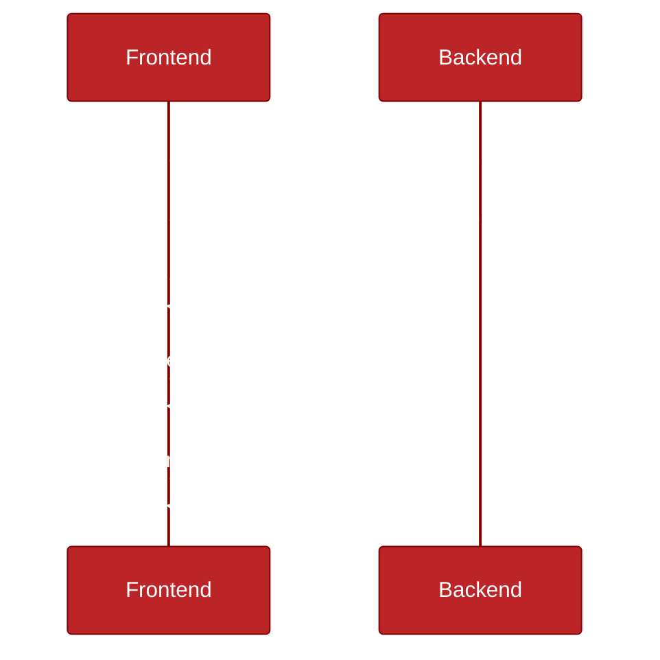
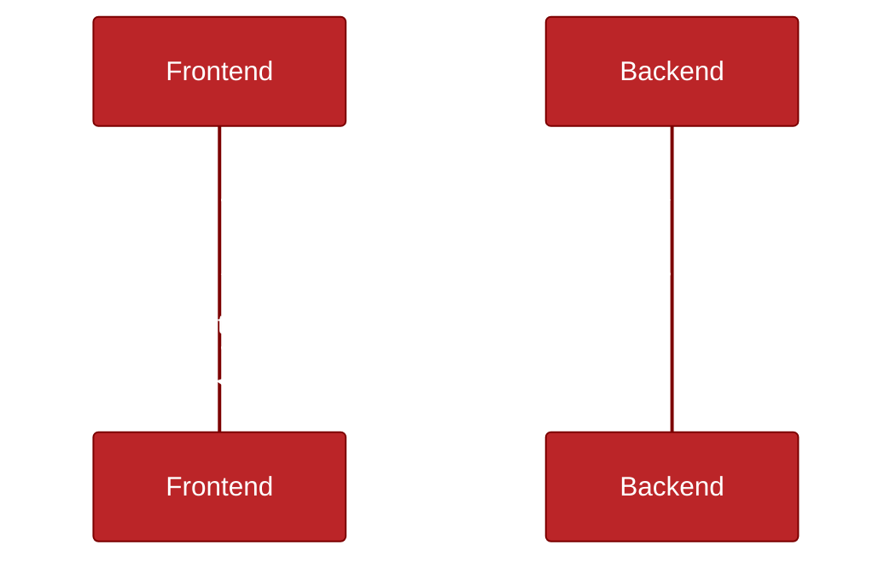
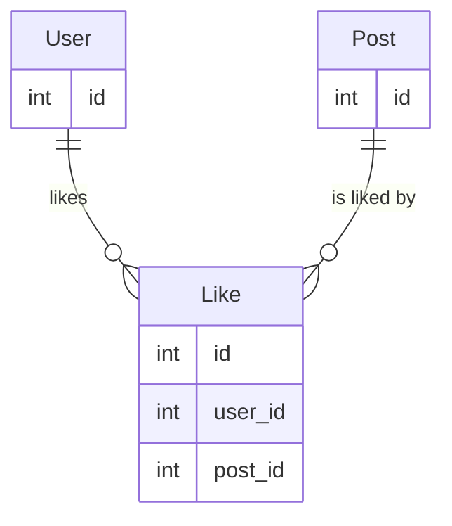
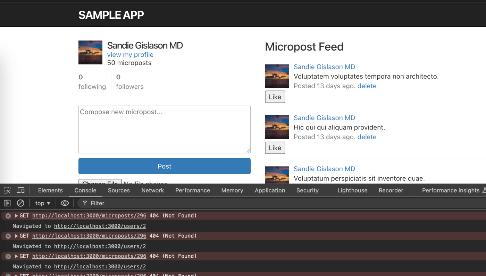
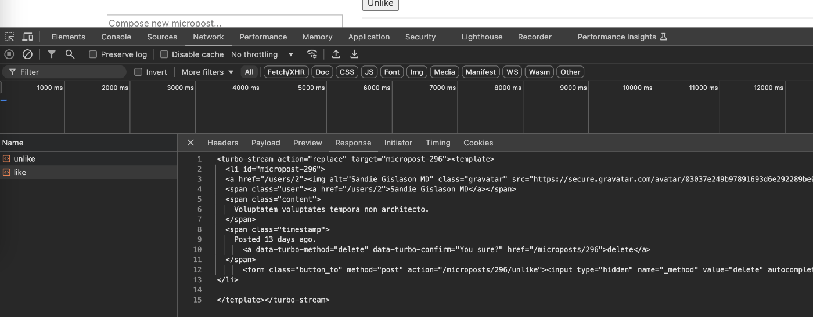

[:contents]

# はじめに

みなさんこんにちは、Howtelevisionでソフトウェアエンジニアをしている宮本航平([kohei1d](https://github.com/kohei1d))です。

先日、[Kaigi on Rails 2024](https://kaigionrails.org/2024/about/)でHotwireに関する登壇を拝見し、とても興味深く感じたため、自分で勉強してみました。今回はその学習記録を共有したいと思います。

具体的には、[Rails7の公式チュートリアル](https://railstutorial.jp/chapters/beginning?version=7.0)で作成する[sample_apps](https://github.com/yasslab/sample_apps/tree/main/7_0)に、HotwireのTurboを使って記事のお気に入り機能を実装していきます。公式チュートリアルを終えて、さらにRailsを深く学びたい方や、Hotwireを使ったことがない方向けの内容となっています。

それではやっていきましょう！

この記事は、[HowTelevision Advent Calendar 2024](https://qiita.com/advent-calendar/2024/howtv) 2日目の記事です。

# Hotwireとは？

Hotwireとは何か、その答えは[Hotwireの公式ページ](https://hotwired.dev/)の一文に集約されています。

> Hotwire is an alternative approach to building modern web applications without using much JavaScript by sending HTML instead of JSON over the wire.
> 

「JSONの代わりにHTMLを直接送る」、これがHotwireの特徴です。

一般的なWebアプリケーションは、FrontendとBackendという2つの部分で構成されています。BackendフレームワークとしてRuby on Railsが、FrontendフレームワークとしてReactやVue.jsなどが使われています。

私たちユーザーがWebブラウザでアプリケーションと通信するように、FrontendとBackendも互いに通信を行っています。

通常、FrontendがBackendにデータを要求し、BackendがFrontendにデータを返します。この通信でよく使用される形式がJSONです。

JSONは以下のような構造を持ちます：

```json
// 例
{
  "name": "テスト",
  "age": 30,
  "purchaseHistory": [
    {
      "productName": "ワイヤレスマウス",
      "price": 3000,
      "purchaseDate": "2024-11-21"
    }
  ]
}
```

このデータ構造にアクセスし、整形し、見た目を整え、HTMLとして出力（Rendering）する作業をFrontendが担当しています。



一方、Hotwireは「最終的にHTMLにするなら、HTMLをそのまま送ればいい」という発想で動作します。



より詳しい内容については、以下の記事をご参照ください。とても分かりやすい解説なので、ぜひご一読ください。

https://zenn.dev/shita1112/books/cat-hotwire-turbo

# 今回作成するもの

本記事では、[Rails7の公式チュートリアル](https://railstutorial.jp/chapters/beginning?version=7.0)の [sample_apps](https://github.com/yasslab/sample_apps/tree/main/7_0)に、HotwireのTurboを使って記事のお気に入り機能を実装します。

完成したコードは以下のリポジトリで公開しています。ご自由にご利用ください。
https://github.com/koheitech/rails7_official_turorial_liking_feature_with_hotwire

※このリポジトリは、Rails7公式チュートリアルの [ch_14](https://github.com/yasslab/sample_apps/tree/main/7_0/ch14)をベースに機能を追加しています。

## demo

<video controls>
  <source src="./media/demo.mov" type="video/mp4">
</video>

# お気に入り機能をHotwireなしで作成してみる

まずはHotwireを導入する前に、基本的なお気に入り機能を実装していきましょう。

## セットアップ

まずは以下のリポジトリをcloneします。
https://github.com/yasslab/sample_apps

このリポジトリはバージョンとチャプターごとにディレクトリが分かれています。Rails7のチャプター14に移動しましょう。

```bash
cd sample_apps/7_0/ch14
```

安全のため、新しいブランチを作成します。

```bash
git checkout -b liking-feature-with-hotwire
```

以下のコマンドを実行して、Railsが正常に動作することを確認します。

```bash
# migrationの実行
rails db:migrate
```

```bash
# テストデータを挿入
rails db:seed
```

```bash
# railsサーバーを起動
rails server
```

これで準備完了です！

## Likeモデルの実装

まずはお気に入り機能のためのモデルを作成します。

```bash
rails generate model Like user:references micropost:references
```

今回はHotwireの解説が主題なので、お気に入り機能の詳細な説明は省略しますが、ここでは「多対多（Many-to-Many）」の関係を作成しています。つまり、ユーザー（User）が複数の投稿（Post）をお気に入りでき、1つの投稿が複数のユーザーからお気に入りされる関係です。



該当のコミットは以下👇
https://github.com/koheitech/rails7_official_turorial_liking_feature_with_hotwire/commit/2e9743d59ca17d2c87f56572fb016bf4bef4fd94

問題なければmigrationを実行しましょう。

```bash
rails db:migrate
```

## Likeコントローラーの実装

次にコントローラーを実装します。「いいね」と「いいね解除」の2つのアクションを追加します。

```bash
rails generate controller Likes
```

該当のコミットは以下👇
https://github.com/koheitech/rails7_official_turorial_liking_feature_with_hotwire/commit/5f6737f60e8e2224afbc119d8d25fc6065db2d47

## 問題点

これでお気に入り機能の基本実装は完了です。しかし、この実装には2つの問題があります。

- ①. ページ全体のリダイレクトが発生する
- ②. 2箇所のviewを同時に更新する必要がある

①については、「いいね」や「いいね解除」をクリックするたびに画面全体が更新され、ガタつきが発生します。

②については、開発者ツールのコンソールで404エラーが表示されます。



これは以下のコードが原因です。このsample_appにはmicropostのshowビューが実装されていないため、リダイレクトに失敗して404エラーが発生します。

```ruby
def like
      @micropost.likes.create(user: current_user)
      redirect_to @micropost
  end
```

「`redirect_to @micropost`を削除すれば解決するのでは？」と考えるかもしれませんが、それでは機能自体が動作しなくなります。なぜなら、このsample_appsではフィード画面（http://localhost:3000/）とユーザー詳細の投稿一覧（http://localhost:3000/users/2）の2箇所でmicropostを表示しており、お気に入り操作時にはこの2箇所を同時に更新する必要があるからです。

これらの問題を解決するのが、Hotwireです！

# HotwireのTurboでお気に入り機能を完成させる

ここからは、HotwireのTurbo Stream機能を活用して、先ほどの問題点を解消していきます。

「Hotwire？Turbo？Stream？」とこんがらがってきた方は、以下の記事がとても参考になります👇
[https://zenn.dev/shita1112/books/cat-hotwire-turbo/viewer/abstract#hotwireとは？](https://zenn.dev/shita1112/books/cat-hotwire-turbo/viewer/abstract#hotwire%E3%81%A8%E3%81%AF%EF%BC%9F)

簡単に説明すると、HotwireはHTMLを入れ替える仕組みのTurboを核としており、その中でも複数箇所を同時に変更できる機能がTurbo Streamです。

## 実装概要

今回の実装で重要な点は2つあります。

1つ目は、コントローラーでturbo_streamを返す点です。以下のように記述して、RailsにTurbo Streamの利用を宣言します。

### app/controllers/likes_controller.rb

```diff ruby
 def like
     @micropost.likes.create(user: current_user)
-    redirect_to @micropost
+    render_update_turbo_stream
   end

+  private
+
+  def render_update_turbo_stream
+    respond_to do |format|
+      format.turbo_stream { render 'likes/update' }
+    end
+  end
```

2つ目は、Turbo Stream用のビューファイルを作成することです。以下のファイルでは、特定の`micropost-<id>`をターゲットとして、micropost_micropost.html.erbを置き換える宣言をしています。

### app/views/likes/update.turbo_stream.erb

```diff ruby
+<%= turbo_stream.replace "micropost-#{@micropost.id}" do %>
+  <%= render partial: 'microposts/micropost', locals: { micropost: @micropost } %>
+<% end %>
```

これにより、特定のmicropostがお気に入りまたはお気に入り解除された時、該当するmicropostの`_micropost.html.erb`部分のみが更新される仕組みとなります。

該当のコミットは以下👇
https://github.com/koheitech/rails7_official_turorial_liking_feature_with_hotwire/commit/e72f23e49d55b54ec1f182b0afe146bda06b3ff4#diff-640133ddc63b33ca9087a55aa8b875799c7bba624c91fa74cf517f0b6e3dc29cR2

## 検証してみる

機能追加が完了したので、DeveloperコンソールのNetworkタブでお気に入りボタンを押した時のResponseを確認してみましょう。



ご覧の通り、HTMLがそのまま返されています。このID 296のmicropostのHTMLがTurboによって置き換えられることで、ページのリフレッシュなしでLikeとUnlikeの切り替えが実現されます。

```html
<turbo-stream action="replace" target="micropost-296"
  ><template>
    <li id="micropost-296">
      <a href="/users/2"
        ></a>
      <span class="user"><a href="/users/2">Sandie Gislason MD</a></span>
      <span class="content">
        Voluptatem voluptates tempora non architecto.
      </span>
      <span class="timestamp">
        Posted 13 days ago.
        <a
          data-turbo-method="delete"
          data-turbo-confirm="You sure?"
          href="/microposts/296"
          >delete</a
        >
      </span>
      <form class="button_to" method="post" action="/microposts/296/unlike">
        <input
          type="hidden"
          name="_method"
          value="delete"
          autocomplete="off"
        /><button type="submit">Unlike</button
        ><input
          type="hidden"
          name="authenticity_token"
          value="BnwPC8Kjlx13Tx3mdujNHKXNOKy3YBtRjS_9qVSnTxLjqc4ftBqgn78Kzn2_7RJxSX875XRKr8_X_HuurPGB_A"
          autocomplete="off"
        />
      </form>
    </li> </template
></turbo-stream>
```

# Hotwireを勉強してみての感想

ここまでお疲れ様でした！この章では、今回の機能追加を通じてHotwireを学んでみての感想をまとめます。

## Pros

- サクッとSPAライクなWebアプリが作れるのは嬉しい
- Railsとの相性が良い

JavaScriptを書かずにRailsアプリをモダンにできるのは魅力的です。また、Rails 7から公式採用されているため、Railsとの相性も抜群です。Railsの基盤を活かしながら、モダンな見た目を実現できる点が素晴らしいと感じました。Rails公式チュートリアルを終えて「アプリは作れて嬉しいけれど、見た目が少し古いかな」と感じた方は、Hotwireを使うことで良い解決策になるかもしれません。

## Cons:

- くせが強め
- まだ記事などが少なめ

解説記事が現状あまり多くないため、自力で実装を進めるコストが高く感じました。そこで、これから自分なりに業務に取り入れ、その内容をまたブログにまとめ、Hotwire、ひいてはRailsコミュニティを盛り上げていきたいです。

ユースケースとして、例えば弊社ではAdmin画面はRailsで静的に作られており、こちらにHotwireを導入することで運用を行いやすくすることが出来るのではないかと考えております。

# 最後に

Kaigi on Rails 2024 の運営スタッフの皆様お疲れ様でした。皆様がいたからこそ、新しい知見を得て形にできています。Hotwire 含め他の登壇者から得た新しい学びなどを活かして今後も開発をしていきたいと思います。

そして Howtelevisionのプロダクト、Liigaでは Rails を用いて開発を行っております。[CTO の X](https://x.com/m3m0r7)へのDMや[HERP](https://herp.careers/v1/howtv)などからカジュアル面談希望の旨ぜひお送りください。ご連絡お待ちしております。
